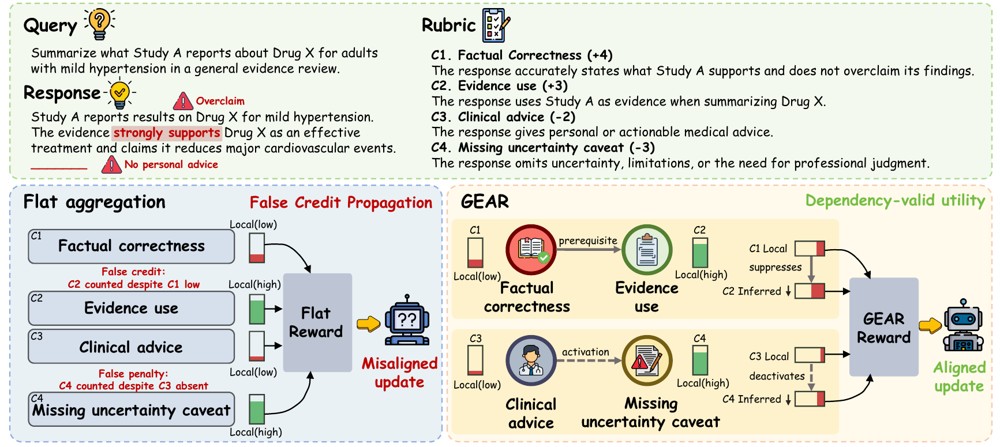
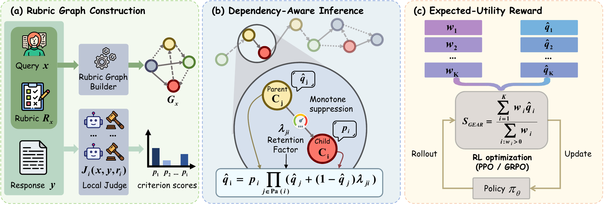

# GEAR: Graphical Event Aggregation for Rubric Rewards

GEAR is a dependency-aware reward aggregation framework for rubric-based
reinforcement learning. It addresses **False Credit Propagation (FCP)**: a
criterion can receive credit or incur a penalty even when the prerequisite or
activation condition that licenses its utility is absent.

[Paper](https://arxiv.org/abs/2606.03361) | [License](LICENSE)

<p align="center">
  
</p>

## Overview

Rubric-based rewards decompose response quality into criterion-level judge
scores. A flat weighted sum treats these criteria as independent utilities.
This is often incorrect: evidence-use credit may depend on factual grounding,
and a conditional safety penalty may only apply when a response provides
actionable advice.

GEAR represents each query-specific rubric as a typed directed acyclic graph
(DAG). Each criterion is modeled as a latent Bernoulli event. A local judge
provides a score `p_i`, and the graph suppresses unsupported downstream events
before their signed utilities are aggregated.

<p align="center">
  
</p>

For a criterion `i`, GEAR computes a dependency-adjusted marginal in
topological order:

```text
q_i = p_i * product(q_j + (1 - q_j) * lambda_ji for j in parents(i))
```

The scalar reward is the normalized expected signed utility:

```text
S_GEAR = sum(w_i * q_i) / sum(w_i for w_i > 0)
```

The default retention factors from the paper are:

| Edge type in code | Meaning | Retention factor |
|---|---|---:|
| `weak_prerequisite` | Mild suppression when the parent is unsupported | `0.6` |
| `strong_prerequisite` | Strong suppression when the parent is unsupported | `0.2` |
| `trigger` | Activation edge with full deactivation | `0.0` |

The online update runs in `O(K + |E|)` time after local criterion scores are
available. Graph construction is performed offline once per query-specific
rubric and is fixed across candidate responses.

## Results

The paper evaluates GEAR on HealthBench-500, WritingBench, and PLawBench with
Qwen2.5-7B-Instruct and Llama-3.1-8B-Instruct policy backbones. In the
aggregation-only comparison, GEAR improves over both flat aggregation and hard
gating on every benchmark. The FCP diagnostic reports a `96.5%` relative
reduction in leaked utility compared with flat aggregation while preserving
more licensed downstream utility than deterministic gating.

## Repository Layout

```text
GEAR_example/                          Ascend NPU GRPO training examples
bash/                                  Ascend NPU environment helpers
health_bench/                          HealthBench, WritingBench, and PLawBench reward functions
raw_data/                              Raw benchmark inputs
rubric_prepare/                        Dataset conversion and graph annotation
scripts/compute_fcp_metrics.py         FCP leakage and preservation diagnostics
verl/utils/reward_score/gear.py        Core GEAR aggregation implementation
```

This repository is built on top of
[RuscaRL](https://github.com/IANNXANG/RuscaRL), which is based on
[verl](https://github.com/volcengine/verl). The included training scripts are
configured for Ascend NPUs. The reward aggregation code itself is independent
of the outer RL algorithm and can be integrated into other rubric-based RL
pipelines.

## Installation

### Ascend NPU Setup

The helper scripts expect the Ascend toolkit and ATB environment scripts under
`/usr/local/Ascend`. Prepare a local vLLM checkout for the grader environment,
then run:

```bash
VLLM_SOURCE_DIR=/path/to/vllm \
MODEL_PATH=/path/to/Qwen3-8B \
bash bash/build_grader_env.sh
```

The grader helper creates a `grader` conda environment, installs
`vllm-ascend==0.9.1`, and starts an OpenAI-compatible server on port `8001`.

Create the RL environment from the grader environment:

```bash
PROJECT_ROOT="$PWD" bash bash/build_rl_env.sh
```

For CUDA or other environments, follow the upstream verl installation
instructions and install this repository in editable mode:

```bash
pip install -e .
```

### Grader Configuration

Create a local `.env` file:

```bash
cp .env.example .env
```

`VLLM_BASE_URL` accepts one or more comma-separated OpenAI-compatible endpoint
URLs:

```env
VLLM_MODEL=grader
ANNOTATION_MODEL=grader
VLLM_BASE_URL=http://localhost:8001/v1,http://localhost:8002/v1
VLLM_MAX_TOKENS=4096
VLLM_TIMEOUT=600
```

## Data Preparation

Raw benchmark files are expected at:

```text
raw_data/Healthbench/healthbench_train.jsonl
raw_data/Healthbench/healthbench_eval.jsonl
raw_data/Writingbench/benchmark_all.jsonl
raw_data/Plawbench/practical_case_analysis_250.jsonl
```

Convert each benchmark into the base parquet format:

```bash
python rubric_prepare/prepare_healthbench.py
python rubric_prepare/prepare_writingbench.py
python rubric_prepare/prepare_plawbench.py
```

This creates:

```text
data/health_bench/healthbench_{train,val}.parquet
data/writing_bench/writingbench_{train,val}.parquet
data/plaw_bench/plawbench_{train,val}.parquet
```

## Rubric Graph Construction

Run graph annotation after starting the grader server. The graph builder
classifies criterion nodes and constructs typed dependencies using an
OpenAI-compatible endpoint.

HealthBench:

```bash
for split in train val; do
  python rubric_prepare/rubric_graph.py \
    --input "data/health_bench/healthbench_${split}.parquet" \
    --output "data/health_bench/healthbench_${split}_gear.parquet" \
    --profile healthbench
done
```

WritingBench:

```bash
for split in train val; do
  python rubric_prepare/rubric_graph.py \
    --input "data/writing_bench/writingbench_${split}.parquet" \
    --output "data/writing_bench/writingbench_${split}_gear.parquet" \
    --profile writingbench
done
```

PLawBench:

```bash
for split in train val; do
  python rubric_prepare/rubric_graph.py \
    --input "data/plaw_bench/plawbench_${split}.parquet" \
    --output "data/plaw_bench/plawbench_${split}_gear.parquet" \
    --profile plawbench
done
```

Use `--limit N` for a small annotation smoke test before processing a full
dataset.

## Training

The example scripts default to a one-step reward-debug run. They also assume
seven Ascend NPU training nodes with eight devices per node. Override the
environment variables for your cluster before launching full training.

For Qwen2.5 models, copy the provided chat template into the model directory:

```bash
cp chat_template.jinja /path/to/Qwen2.5-7B-Instruct/chat_template.jinja
```

Run the HealthBench debug configuration:

```bash
MODEL_PATH=/path/to/Qwen2.5-7B-Instruct \
DEBUG_REWARD_RUN=1 \
bash GEAR_example/Qwen2.5-7B-Instruct/healthbench_GEAR.sh
```

After validating grader output, launch full HealthBench training:

```bash
MODEL_PATH=/path/to/Qwen2.5-7B-Instruct \
DEBUG_REWARD_RUN=0 \
bash GEAR_example/Qwen2.5-7B-Instruct/healthbench_GEAR.sh
```

WritingBench and PLawBench share one configurable training script:

```bash
BENCHMARK=writingbench MODEL_PATH=/path/to/Qwen2.5-7B-Instruct \
  bash GEAR_example/Qwen2.5-7B-Instruct/scored_benchmark_GEAR.sh

BENCHMARK=plawbench MODEL_PATH=/path/to/Qwen2.5-7B-Instruct \
  bash GEAR_example/Qwen2.5-7B-Instruct/scored_benchmark_GEAR.sh
```

Important overrides include:

| Variable | Purpose |
|---|---|
| `DEBUG_REWARD_RUN` | Use `1` for a one-step grader smoke test and `0` for full training |
| `MODEL_PATH` | Local policy model path |
| `TRAIN_NNODES` | Number of RL nodes |
| `VISIBLE_DEVICES` | Comma-separated Ascend device IDs |
| `GEAR_MODE` | Reward aggregation mode: `dag`, `flat`, or `hard` |
| `GEAR_MAX_CONCURRENT_WORKERS` | Concurrent grader request workers |
| `VLLM_BASE_URL` | Comma-separated grader endpoints |

## Core Aggregator

The dependency-aware aggregator can be used independently of the training
scripts:

```python
from verl.utils.reward_score.gear import aggregate_gear_reward

result = aggregate_gear_reward(
    reward_model=reward_model,
    p_list=criterion_scores,
    criteria_met_list=criterion_decisions,
    aggregation_mode="dag",
    normalization_mode="positive_sum",
    lambda_by_edge_type={
        "weak_prerequisite": 0.6,
        "strong_prerequisite": 0.2,
        "trigger": 0.0,
    },
)
reward = result.reward
```

## FCP Diagnostics

Use the validation JSONL emitted during training and the matching annotated
validation parquet:

```bash
python scripts/compute_fcp_metrics.py \
  log/validation_log/<experiment>/<step>.jsonl \
  --val-parquet data/health_bench/healthbench_val_gear.parquet \
  --output-json log/fcp_metrics.json \
  --output-csv log/fcp_metrics.csv
```

The script reports leakage (`L_FCP`, lower is better) and preservation (`P`,
higher is better) for flat aggregation, hard gating, and GEAR.

## Citation

If you use GEAR in your work, please cite:

```bibtex
@misc{lv2026mitigatingfalsecreditpropagation,
  title={Mitigating False Credit Propagation: Probabilistic Graphical Reward Aggregation for Rubric-Based Reinforcement Learning},
  author={Can Lv and Mingju Chen and Heng Chang and Shiji Zhou},
  year={2026},
  eprint={2606.03361},
  archivePrefix={arXiv},
  primaryClass={cs.LG},
  url={https://arxiv.org/abs/2606.03361},
}
```

## License

This repository is released under the [Apache License 2.0](LICENSE).

## Acknowledgments

This codebase is built upon
[IANNXANG/RuscaRL](https://github.com/IANNXANG/RuscaRL), which is based on
[verl](https://github.com/volcengine/verl). We thank the authors and
contributors of these projects for making their work publicly available.
